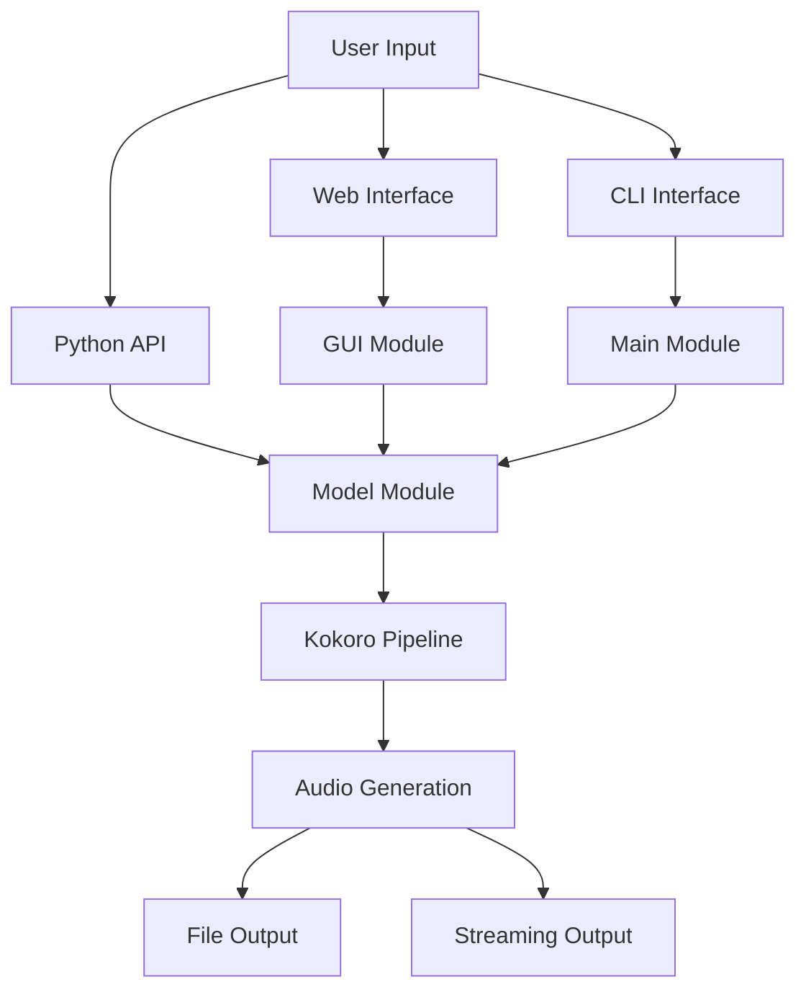

# 🛠️ Development Guide

Complete guide for developers who want to contribute to or extend Vocalizr.

## Table of Contents

- [Development Setup](#development-setup)
- [Architecture Overview](#architecture-overview)
- [Code Organization](#code-organization)
- [Development Workflow](#development-workflow)
- [Testing](#testing)
- [Code Quality](#code-quality)
- [Documentation](#documentation)
- [Debugging](#debugging)
- [Contributing](#contributing)

## Development Setup

### Prerequisites

- Python 3.12 or higher
- Git
- uv package manager (recommended) or pip
- Docker (optional, for containerized development)

### Clone and Setup

```bash
# Clone the repository
git clone https://github.com/AlphaSphereDotAI/vocalizr.git
cd vocalizr

# Install with uv (recommended)
uv sync
```

### Development Dependencies

The project includes these development tools:

- **ruff**: Code formatting and linting
- **ty**: Type checking utilities
- **pytest**: Testing framework (when added)
- **trunk**: Git hooks for code quality

### IDE Setup

#### VS Code

Create `.vscode/settings.json`:

```json
{
    "python.defaultInterpreterPath": "./venv/bin/python",
    "python.linting.enabled": true,
    "python.linting.ruffEnabled": true,
    "python.formatting.provider": "ruff",
    "python.sortImports.args": ["--profile", "black"],
    "editor.formatOnSave": true,
    "editor.codeActionsOnSave": {
        "source.organizeImports": true
    },
    "files.exclude": {
        "**/__pycache__": true,
        "**/*.pyc": true,
        ".pytest_cache": true,
        ".ruff_cache": true
    }
}
```

Create `.vscode/launch.json` for debugging:

```json
{
    "version": "0.2.0",
    "configurations": [
        {
            "name": "Run Vocalizr",
            "type": "python",
            "request": "launch",
            "module": "vocalizr",
            "console": "integratedTerminal",
            "env": {
                "DEBUG": "true",
                "GRADIO_SERVER_PORT": "7860"
            }
        },
        {
            "name": "Debug Tests",
            "type": "python",
            "request": "launch",
            "module": "pytest",
            "args": ["-v", "tests/"],
            "console": "integratedTerminal"
        }
    ]
}
```

#### PyCharm

1. Open the project in PyCharm
2. Configure Python interpreter to use the virtual environment
3. Enable Ruff as the code formatter and linter
4. Set up run configurations for the application and tests

## Architecture Overview

### High-Level Architecture

```
┌─────────────────────────────────────────────────────────────┐
│                    Vocalizr Application                     │
├─────────────────────────────────────────────────────────────┤
│  Web Interface (Gradio)  │  CLI Interface  │  Python API   │
├─────────────────────────────────────────────────────────────┤
│                Core Generation Engine                       │
│              (generate_audio_for_text)                     │
├─────────────────────────────────────────────────────────────┤
│                 Kokoro AI Pipeline                         │
│                (Text-to-Speech Model)                      │
├─────────────────────────────────────────────────────────────┤
│     PyTorch Backend     │     Audio Processing             │
│    (CUDA/CPU Support)   │    (soundfile, numpy)           │
└─────────────────────────────────────────────────────────────┘
```

### Component Interaction



### Data Flow

1. **Input Processing**: Text input validation and preprocessing
2. **Voice Selection**: Voice ID mapping to model parameters
3. **Generation**: Kokoro pipeline processes text to audio
4. **Post-processing**: Audio normalization and formatting
5. **Output**: Streaming audio or file save

## Code Organization

### Directory Structure

```
vocalizr/
├── src/vocalizr/          # Main package
│   ├── __init__.py        # Package initialization & config
│   ├── __main__.py        # CLI entry point
│   ├── gui.py             # Gradio web interface
│   └── model.py           # Core generation logic
├── docs/                  # Documentation
├── tests/                 # Test files (to be added)
├── scripts/               # Utility scripts
├── examples/              # Usage examples
├── .github/               # GitHub workflows
├── pyproject.toml         # Project configuration
├── Dockerfile             # Container configuration
├── compose.yaml           # Docker Compose setup
└── README.md              # Main documentation
```

### Module Responsibilities

#### `__init__.py`
- Global configuration and constants
- Environment variable loading
- Logging setup
- Pipeline initialization
- Voice choices mapping

```python
# Key exports
DEBUG: bool
SERVER_NAME: str
SERVER_PORT: int
PIPELINE: KPipeline
CHOICES: dict[str, str]
CUDA_AVAILABLE: bool
```

#### `__main__.py`
- CLI entry point
- Application launcher
- Gradio app configuration

```python
def main() -> None:
    """Launch the Gradio voice generation web application."""
```

#### `gui.py`
- Gradio interface components
- User interaction handling
- UI layout and controls

```python
def app_block() -> Blocks:
    """Create and return the main application interface."""
```

#### `model.py`
- Core audio generation logic
- File I/O operations
- Error handling

```python
def generate_audio_for_text(...) -> Generator[...]:
    """Generates audio from text using specified voice and speed."""

def save_file_wav(audio: ndarray) -> None:
    """Saves audio array to WAV file."""
```

## Development Workflow

### Setting Up Development Environment

```bash
# 1. Create development branch
git checkout -b feature/your-feature-name

# 2. Set up development environment
export DEBUG=true
export GRADIO_SERVER_PORT=7860

# 3. Install in development mode
pip install -e ".[dev]"

# 4. Run the application
python -m vocalizr
```

### Code Style and Standards

#### Formatting with Ruff

```bash
# Check code style
ruff check src/

# Format code
ruff format src/

# Check and fix issues
ruff check --fix src/
```

#### Type Hints

Use comprehensive type hints throughout the codebase:

```python
from typing import Generator, Literal, Any
from numpy import ndarray, dtype, float32

def generate_audio_for_text(
    text: str,
    voice: str = "af_heart",
    speed: float = 1.0,
    save_file: bool = False,
    debug: bool = False,
    char_limit: int = -1,
) -> Generator[
    tuple[Literal[24000], ndarray[tuple[float32], dtype[float32]]],
    Any,
    None,
]:
    """Type-annotated function with detailed return type."""
```

#### Documentation Standards

Use comprehensive docstrings following Google style:

```python
def generate_audio_for_text(
    text: str,
    voice: str = "af_heart",
    speed: float = 1.0,
    save_file: bool = False,
    debug: bool = False,
    char_limit: int = -1,
) -> Generator[...]:
    """
    Generates audio from the provided text using the specified voice and speed.

    It allows saving the generated audio to a file if required. The function
    yields tuples containing the audio sampling rate and the audio data as a
    NumPy array.

    Args:
        text: The input text to generate audio for. If char_limit is set to a
            positive value, the text will be truncated to fit that limit.
        voice: The voice profile to use for audio generation.
            Defaults to "af_heart".
        speed: The speed modifier for audio generation. Defaults to 1.0.
        save_file: Whether to save the generated audio to a file. Defaults
            to False.
        debug: Whether to enable debug mode. Defaults to False.
        char_limit: The maximum number of characters to include in the input.

    Yields:
        A tuple where the first element is the fixed sampling rate of 24,000 Hz,
        and the second element is a NumPy array representing the generated
        audio data.

    Raises:
        Error: If audio generation fails or unexpected type is returned.
        RuntimeError: If file saving fails when save_file is True.
    """
```

### Git Workflow

#### Commit Message Standards

Follow conventional commit format:

```bash
# Feature commits
git commit -m "feat: add new voice selection interface"

# Bug fixes
git commit -m "fix: resolve memory leak in audio generation"

# Documentation
git commit -m "docs: update API documentation with examples"

# Refactoring
git commit -m "refactor: simplify audio processing pipeline"

# Tests
git commit -m "test: add unit tests for voice selection"
```

#### Branch Naming

Use descriptive branch names:

```bash
# Features
feature/voice-customization
feature/batch-processing

# Bug fixes
fix/memory-leak
fix/gradio-interface-crash

# Documentation
docs/api-reference
docs/deployment-guide

# Refactoring
refactor/model-architecture
refactor/error-handling
```

## Testing

### Test Structure

Create comprehensive tests following this structure:

```
tests/
├── unit/                  # Unit tests
│   ├── test_model.py      # Model function tests
│   ├── test_gui.py        # GUI component tests
│   └── test_config.py     # Configuration tests
├── integration/           # Integration tests
│   ├── test_pipeline.py   # End-to-end pipeline tests
│   └── test_api.py        # API integration tests
├── fixtures/              # Test data and fixtures
│   ├── sample_texts.py    # Sample text inputs
│   └── expected_outputs/  # Expected audio outputs
└── conftest.py            # Pytest configuration
```

### Writing Tests

#### Unit Tests Example

```python
# tests/unit/test_model.py
import pytest
import numpy as np
from unittest.mock import patch, MagicMock
from vocalizr.model import generate_audio_for_text, save_file_wav

class TestGenerateAudioForText:
    """Test suite for generate_audio_for_text function."""

    def test_basic_generation(self):
        """Test basic audio generation with default parameters."""
        text = "Hello, world!"

        # Mock the pipeline to avoid actual model calls
        with patch('vocalizr.model.PIPELINE') as mock_pipeline:
            mock_pipeline.return_value = [
                (None, None, np.array([0.1, 0.2, 0.3], dtype=np.float32))
            ]

            results = list(generate_audio_for_text(text))

            assert len(results) > 0
            sample_rate, audio = results[0]
            assert sample_rate == 24000
            assert isinstance(audio, np.ndarray)

    def test_invalid_text_input(self):
        """Test handling of invalid text input."""
        with pytest.raises(Exception):
            list(generate_audio_for_text(""))

        with pytest.raises(Exception):
            list(generate_audio_for_text("abc"))  # Too short

    def test_voice_selection(self):
        """Test different voice selections."""
        text = "Testing voice selection"

        for voice in ["af_heart", "bf_emma", "am_michael"]:
            with patch('vocalizr.model.PIPELINE') as mock_pipeline:
                mock_pipeline.return_value = [
                    (None, None, np.array([0.1], dtype=np.float32))
                ]

                results = list(generate_audio_for_text(text, voice=voice))
                assert len(results) > 0

class TestSaveFileWav:
    """Test suite for save_file_wav function."""

    def test_save_valid_audio(self, tmp_path):
        """Test saving valid audio data."""
        audio = np.array([0.1, 0.2, 0.3], dtype=np.float32)

        with patch('vocalizr.model.AUDIO_FILE_PATH', tmp_path / 'test.wav'):
            save_file_wav(audio)
            assert (tmp_path / 'test.wav').exists()

    def test_save_invalid_audio(self):
        """Test error handling for invalid audio data."""
        with pytest.raises(RuntimeError):
            save_file_wav(None)
```

#### Integration Tests Example

```python
# tests/integration/test_pipeline.py
import pytest
from vocalizr.model import generate_audio_for_text

class TestPipelineIntegration:
    """Integration tests for the complete pipeline."""

    @pytest.mark.slow
    def test_end_to_end_generation(self):
        """Test complete end-to-end audio generation."""
        text = "This is a comprehensive integration test."

        results = list(generate_audio_for_text(
            text=text,
            voice="af_heart",
            speed=1.0
        ))

        assert len(results) > 0

        for sample_rate, audio in results:
            assert sample_rate == 24000
            assert len(audio) > 0
            assert audio.dtype == np.float32

    @pytest.mark.parametrize("voice", [
        "af_heart", "bf_emma", "am_michael", "bm_george"
    ])
    def test_voice_compatibility(self, voice):
        """Test compatibility across different voices."""
        text = "Voice compatibility test"

        results = list(generate_audio_for_text(text, voice=voice))
        assert len(results) > 0
```

### Running Tests

```bash
# Run all tests
pytest

# Run with coverage
pytest --cov=src/vocalizr --cov-report=html

# Run specific test file
pytest tests/unit/test_model.py

# Run tests with specific markers
pytest -m "not slow"  # Skip slow tests

# Run tests in parallel
pytest -n auto
```

### Test Configuration

Create `tests/conftest.py`:

```python
# tests/conftest.py
import pytest
import tempfile
import os
from pathlib import Path

@pytest.fixture
def temp_dir():
    """Create a temporary directory for tests."""
    with tempfile.TemporaryDirectory() as tmp_dir:
        yield Path(tmp_dir)

@pytest.fixture
def mock_environment():
    """Mock environment variables for testing."""
    original_env = os.environ.copy()

    # Set test environment
    os.environ.update({
        'DEBUG': 'true',
        'GRADIO_SERVER_PORT': '7861',  # Different port for tests
        'HF_HOME': '/tmp/test_cache'
    })

    yield

    # Restore original environment
    os.environ.clear()
    os.environ.update(original_env)

@pytest.fixture
def sample_texts():
    """Provide sample texts for testing."""
    return [
        "Hello, world!",
        "This is a longer test sentence for audio generation.",
        "Testing with numbers: 123 and symbols: !@#$%",
        "Multi-sentence test. This has multiple sentences. End of test."
    ]
```

## Code Quality

### Pre-commit Hooks

Set up pre-commit hooks to ensure code quality:

```yaml
# .pre-commit-config.yaml
repos:
  - repo: https://github.com/astral-sh/ruff-pre-commit
    rev: v0.1.6
    hooks:
      - id: ruff
        args: [--fix, --exit-non-zero-on-fix]
      - id: ruff-format

  - repo: https://github.com/pre-commit/pre-commit-hooks
    rev: v4.5.0
    hooks:
      - id: trailing-whitespace
      - id: end-of-file-fixer
      - id: check-merge-conflict
      - id: check-yaml
      - id: check-toml

  - repo: https://github.com/python-poetry/poetry
    rev: 1.7.0
    hooks:
      - id: poetry-check
```

Install and activate:

```bash
pip install pre-commit
pre-commit install
```

### Code Review Checklist

Before submitting PRs, ensure:

- [ ] Code follows Ruff formatting standards
- [ ] All type hints are present and accurate
- [ ] Comprehensive docstrings for all functions
- [ ] Unit tests cover new functionality
- [ ] Integration tests pass
- [ ] No breaking changes to existing API
- [ ] Documentation updated for new features
- [ ] Error handling implemented
- [ ] Performance impact considered
- [ ] Security implications reviewed

## Documentation

### Building Documentation

```bash
# Generate API documentation
python -c "
import inspect
from vocalizr import model, gui
print('Model functions:', [name for name, obj in inspect.getmembers(model, inspect.isfunction)])
print('GUI functions:', [name for name, obj in inspect.getmembers(gui, inspect.isfunction)])
"

# Validate documentation links
python scripts/validate_docs.py
```

### Documentation Standards

1. **README**: Keep updated with latest features
2. **API Docs**: Auto-generate from docstrings when possible
3. **Examples**: Provide working code examples
4. **Tutorials**: Step-by-step guides for common tasks
5. **Architecture**: Diagrams and explanations

## Debugging

### Debug Configuration

Set up debugging environment:

```bash
export DEBUG=true
export GRADIO_SERVER_PORT=7860
export VOCALIZR_LOG_LEVEL=DEBUG
```

### Common Debug Scenarios

#### Memory Issues

```python
import psutil
import torch
import gc

def debug_memory():
    """Debug memory usage."""
    process = psutil.Process()
    memory_info = process.memory_info()

    print(f"RSS: {memory_info.rss / 1024**2:.1f} MB")
    print(f"VMS: {memory_info.vms / 1024**2:.1f} MB")

    if torch.cuda.is_available():
        print(f"GPU Memory: {torch.cuda.memory_allocated() / 1024**2:.1f} MB")
        print(f"GPU Cached: {torch.cuda.memory_reserved() / 1024**2:.1f} MB")

# Use before and after generation
debug_memory()
```

#### Performance Profiling

```python
import cProfile
import pstats
from vocalizr.model import generate_audio_for_text

def profile_generation():
    """Profile audio generation performance."""
    pr = cProfile.Profile()
    pr.enable()

    # Your code here
    list(generate_audio_for_text("Test profiling text"))

    pr.disable()
    stats = pstats.Stats(pr)
    stats.sort_stats('cumulative')
    stats.print_stats(10)

profile_generation()
```

### Logging for Development

```python
from loguru import logger

# Add debug-specific logging
logger.add(
    "debug.log",
    level="DEBUG",
    format="{time} | {level} | {name}:{function}:{line} | {message}",
    rotation="1 MB"
)

def debug_generation(text, voice):
    """Debug wrapper for generation."""
    logger.debug(f"Starting generation: text='{text[:50]}...', voice={voice}")

    try:
        for i, (sr, audio) in enumerate(generate_audio_for_text(text, voice)):
            logger.debug(f"Generated chunk {i}: {len(audio)} samples")
            yield sr, audio
    except Exception as e:
        logger.exception(f"Generation failed: {e}")
        raise
```

## Contributing

### Getting Started

1. **Fork the repository** on GitHub
2. **Clone your fork** locally
3. **Create a feature branch** from main
4. **Make your changes** following the development standards
5. **Add tests** for new functionality
6. **Update documentation** as needed
7. **Submit a pull request** with detailed description

### Pull Request Guidelines

#### PR Title Format
```
type(scope): brief description

Examples:
feat(model): add batch processing support
fix(gui): resolve memory leak in audio player
docs(api): add integration examples
refactor(core): simplify pipeline initialization
```

#### PR Description Template
```markdown
## Description
Brief description of changes made.

## Type of Change
- [ ] Bug fix (non-breaking change which fixes an issue)
- [ ] New feature (non-breaking change which adds functionality)
- [ ] Breaking change (fix or feature that would cause existing functionality to not work as expected)
- [ ] Documentation update

## Testing
- [ ] Unit tests added/updated
- [ ] Integration tests added/updated
- [ ] All tests pass locally

## Checklist
- [ ] Code follows project style guidelines
- [ ] Self-review of code completed
- [ ] Documentation updated
- [ ] No breaking changes introduced
```

### Review Process

1. **Automated Checks**: CI/CD pipeline runs tests and linting
2. **Code Review**: Maintainers review code quality and design
3. **Testing**: Verify functionality works as expected
4. **Documentation**: Ensure docs are updated appropriately
5. **Merge**: Approved PRs are merged to main branch

## Next Steps

- Review [Contributing Guidelines](CONTRIBUTING.md) for detailed contribution process
- Check [Examples](EXAMPLES.md) for practical development examples
- See [API Documentation](API.md) for detailed technical reference
- Explore [Troubleshooting](TROUBLESHOOTING.md) for development issues